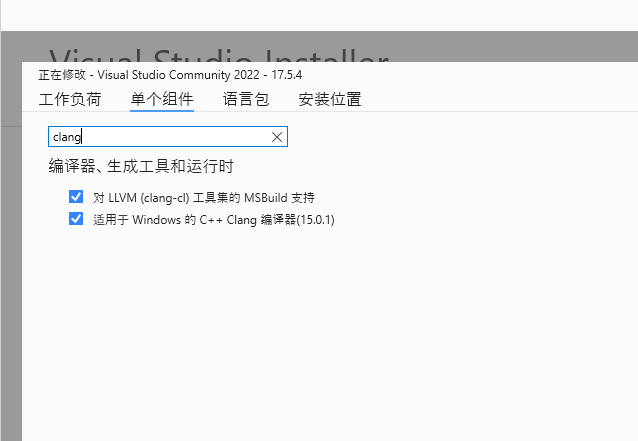

# ZhiJinComplier
> 基于Fastbuild 的分布式编译系统

---

# 上手指南

## 安装开发环境
这里使用的Visual Studio 版本为 [Visual Studio Community 2022](https://visualstudio.microsoft.com/vs/community/)

所选的开发配置有以下
**使用C++的桌面开发** 和 **通用Windows平台开发**


点击单个组件->**勾选Windows10 SDK (10.0.19041.0)**
> Windows10 SDK 后缀版本应该对编译没影响，这里只是选择更为通用的 10.0.1904 版本


点击单个组件->搜索**Clang**->全部勾选


点击执行进行安装

## 编译Fastbuild
Fastbuild 编译需要强依赖正确的VS Tools的路径

1. 首先是选定VS 版本
文件路径在 `External\SDK\VisualStudio\VisualStudio.bff`
注释掉其他VS版本仅保留VS2022
```
//------------------------------------------------------------------------------
//#define USING_VS2017
//#define USING_VS2019
#define USING_VS2022
```

2. 在VS2022.bff 中定义路径
文件路径在 `External\SDK\VisualStudio\VS2022.bff`
这里将VS2022的版本改为本机上的 `2052` 版本
```
    .VS2022_MSC_VER         = '2052'

```

如果VS Tools的路径不在C盘，还可以自定义VS Tools的路径
```
Print( '-----------------------------------------------------------------------' )
Print( '- Unable to auto-detect VS2022 - please specify installation manually -' )
Print( '-----------------------------------------------------------------------' )
.VS2022_BasePath        = .Set_Path_Here    // <-- Set path here
.VS2022_Version         = .Set_Version_Here // <-- Set version here
.VS2022_MSC_VER         = .Set_MSC_VER_Here // <-- Set MSC_VER here
```

同个文件下还修改了全部编译的警告等级，从`WX`改为`W4`
```
                                    // Warnings
                                    + ' /Wall'              // Enable all warnings (we'll disable those that are not useful)
                                    + ' /W4'                // Warnings as errors

```
```
    .LibrarianOptions               = '/NODEFAULTLIB /W4 /NOLOGO /OUT:"%2" "%1"'
```
```
    // Linker
    .Linker                         = '$VS2022_ToolchainPath$/bin/Hostx64/x64/link.exe'
    .LinkerOptions                  = '/NODEFAULTLIB /W4 /NOLOGO /INCREMENTAL:NO /OUT:"%2" "%1" /DEBUG'
                                    + .VSLibPaths
```


3. 修改fbuild 的Clang版本
文件路径在 `Code\fbuild.bff`
这里我们改为使用的版本是Clang6
102 行处修改
```
.Fuzzer_Config =
[
    #if USING_CLANG_6
        // These options are valid for Clang >= 6.0.0:
        .CompilerOptions                = ' -fsanitize=fuzzer-no-link'

```

439行处修改
```
#if USING_CLANG_6
                               + { 'ASan', 'MSan', 'TSan' }
#endif

```

4. 修改VS 的Clang11 路径
文件路径 `External\SDK\Clang\Windows\Clang11.bff`
修改处如下
```
        #else
            //
            // Failed
            //
            Print( '----------------------------------------------------------------------' )
            Print( '- Unable to auto-detect Clang - please specify installation manually -' )
            Print( '----------------------------------------------------------------------' )
            .Clang11_Version    = '11.x.x'
            .Clang11_BasePath = 'C:\Program Files\Microsoft Visual Studio\2022\Community\VC\Tools\Llvm\x64'   // <-- Set path here
        #endif
```
这里指定了Clang的版本和基础路径是在`C:\Program Files\Microsoft Visual Studio\2022\Community\VC\Tools\Llvm\x64`下

并且还修改了第100行的编译选项，将默认的最高等级的`WX`改为较低等级的`W4`以便让编译通过
```
    .LinkerOptions                  = '/NODEFAULTLIB /W4 /NOLOGO /INCREMENTAL:NO /OUT:"%2" "%1" /DEBUG'
```

## 执行编译
你需要从原版的Fastbuild 官网上下载[Fastbuild](https://fastbuild.org/downloads/v1.09/FASTBuild-Windows-x64-v1.09.zip) 来对其进行编译

将解压出来的`FBuild.exe`解压到%PATH%能识别的路径下，或者直接以绝对路径进行运行也行

### 查看编译目标
进入到 `./Code` 文件内
执行查看编译目标选项

```cmd
PS C:\repo\fastbuild\Code> FBuild.exe -showtargets
Using VS2022 (v14.35.32215) from C:/Program Files/Microsoft Visual Studio/2022/Community/VC/Tools/MSVC/14.35.32215
----------------------------------------------------------------------
- Unable to auto-detect Clang - please specify installation manually -
----------------------------------------------------------------------
Using Clang 11.x.x from C:\Program Files\Microsoft Visual Studio\2022\Community\VC\Tools\Llvm\x64
FBuild: List of available targets
        ResourceCompiler        
        LZ4-Lib-x64-Debug       
        LZ4-x64-Debug
        ...
        ...
        All-x64
        solution
```

开始编译FBuild
```
PS C:\repo\fastbuild\Code> Fbuild.exe -clean FBuild-x64-Release 
Using VS2022 (v14.35.32215) from C:/Program Files/Microsoft Visual Studio/2022/Community/VC/Tools/MSVC/14.35.32215
----------------------------------------------------------------------
- Unable to auto-detect Clang - please specify installation manually -
----------------------------------------------------------------------
Using Clang 11.x.x from C:\Program Files\Microsoft Visual Studio\2022\Community\VC\Tools\Llvm\x64
...
...
FBuild: OK: FBuild-x64-Release
Time: 20.780s
```

编译成功后的产物在`tmp\x64-Release\Tools\FBuild\FBuild` 文件夹内

### 二次开发

如果你想二次开发FBuild，选择编译 **solution**
```
Fbuild.exe solution
```

此时VS 解决方案文件就在 `tmp\VisualStudio\FASTBuild.sln` 路径上

# 获取构建进度

---

通过自举FBuild 来演示如果获取构建进度

将上一步编译出来的`FBuild.exe`替换原版的`FBuild.exe`或者提取到另一个文件夹内，不能直接通过`tmp\x64-Release\Tools\FBuild\FBuild\FBuild.exe -clean build something` 的方式来编译

因为**Micro$oft Windows** 会锁定进程的物理文件，如果我们直接编译会报错说*无法替换FBuild.exe文件*


需要的监视构建进度的辅助模块在`./AutoBuild`目录下
* 截至 *2023/5/17* 目前只有 `AutoBuild\client\watcher.py` 监视功能模块能正常使用，其他模块还在开发中

## 监视进度
首先启动Python 环境，这里配置好了venv 环境可以一键启动
```
.\AutoBuild\.venv\Scripts\activate.bat
```

运行监视模块，该模块会监视 `%TEMP%/FastBuild/FastBuildLog.log` 文件
```
> python AutoBuild\client\watcher.py
BIG BROTHER IS WATCHING YOU
```

## 开始构建
这里的构建命令必须选择 `-monitor` 才会显示构建进度

```cmd
cd .\Code\
Fbuild.exe -clean -dist -monitor -summary -forceremote -j2 FBuild-x64-Release 
```
编译选项解释
* `-clean`: 强制清理依赖缓存文件
* `-dist`: 开启分布式编译
* `-monitor`: 开启第三方监视功能
* `-summary`: 开启编译结束后的总结功能
* `-forceremote`: 强制远程协同编译
* `-j2`: 使用两个逻辑核编译
* `FBuild-x64-Release`: 编译对象

## 构建进度

打印的构建进度格式为
```
time: 本机的时间
name: 构建目标名称
stats: 有四种情况:
        a. process 构建中
        b. cache 命中缓存
        c. failed 构建失败
        d. success 构建成功
location: 编译机器的IP地址
buildtime: 构建花费时间
```
显示结果大概如下
```
time: 2023-05-17 10:57:41, name: C:\repo\fastbuild\External\LZ4\lz4-1.9.3\lib\lz4hc.c, stats: process, location: 127.0.0.1, buildtime: 0
time: 2023-05-17 10:57:41, name: C:\repo\fastbuild\External\LZ4\lz4-1.9.3\lib\lz4hc.c, stats: success, location: 127.0.0.1, buildtime: 0
time: 2023-05-17 10:57:41, name: C:\Program Files\Microsoft Visual Studio\2022\Community\VC\Tools\MSVC\14.35.32215\bin\Hostx64\x64\2052\mspft140ui.dll, stats: process, location: 127.0.0.1, buildtime: 0
time: 2023-05-17 10:57:41, name: C:\Program Files\Microsoft Visual Studio\2022\Community\VC\Tools\MSVC\14.35.32215\bin\Hostx64\x64\vcruntime140_1.dll, stats: process, location: 127.0.0.1, buildtime: 0
```

